# ADD v1.0 — QQQ Cycle-Conditional Law Engine 架构设计文档

> **配套规范**: SRD v8.7 (exec-final)
> **目标读者**: AI coding agents（主要） / 量化研究工程师（次要）
> **实现语言**: Python 3.11+
> **运行形态**: Mac 本地 Docker Compose 容器
> **范式**: Functional Core / Imperative Shell（纯函数核心 + 显式副作用边界）
> **文档优先级**: `SRD v8.7` > `ADD v1.0`。当二者冲突时，SRD 优先；本 ADD 仅规定**如何实现** SRD 要求的内容，不得引入未写入 SRD 的数学或参数。
> **不变量**: 本 ADD 中所有 `MUST` / `MUST NOT` 均由 `tests/` 中的单元测试或 CI 工作流强制执行；凡是不能被测试捕获的规则，不得声明为 `MUST`。

---

## 目录

- [0. 阅读指南与文档约定](#0-阅读指南与文档约定)
- [1. 设计目标与非目标](#1-设计目标与非目标)
- [2. 顶层架构（Context + Container）](#2-顶层架构)
- [3. 分层架构与 FP 纯核边界](#3-分层架构与-fp-纯核边界)
- [4. 数据架构与点时契约（PIT）](#4-数据架构与点时契约pit)
- [5. 计算管道架构（Features → State → Law → Decision）](#5-计算管道架构)
- [6. 运行时与容器架构](#6-运行时与容器架构)
- [7. 测试架构（禁止造轮子原则）](#7-测试架构)
- [8. 可观测性与 artifacts 契约](#8-可观测性与-artifacts-契约)
- [9. CI/CD 架构](#9-cicd-架构)
- [10. 失效、降级与熔断](#10-失效降级与熔断)
- [11. 研究-生产防火墙](#11-研究-生产防火墙)
- [12. 扩展路径（v8.8 Panel）](#12-扩展路径v88-panel)
- [附录 A：完整目录树](#附录-a完整目录树)
- [附录 B：跨模块接口签名索引](#附录-b跨模块接口签名索引)
- [附录 C：冻结常量与 SRD 章节交叉引用](#附录-c冻结常量与-srd-章节交叉引用)

---

## 0. 阅读指南与文档约定

### 0.1 规范等级

| 关键词       | 含义                                              | 强制手段                      |
| ------------ | ------------------------------------------------- | ----------------------------- |
| **MUST**     | 硬性要求                                          | 单元测试 + CI 门禁            |
| **MUST NOT** | 禁止                                              | 单元测试 + CI 门禁（import linter / AST grep） |
| **SHOULD**   | 默认，偏离需在 PR 描述中写明 `deviation-note:`    | 人审 + PR template 检查        |
| **MAY**      | 可选                                              | 无                            |

AI coding agent 实现任何模块时，先读 SRD 对应章节，再读 ADD 同名章节；**二者不一致处 SRD 优先**，并在 PR 中提交 `srd-vs-add-conflict.md` 说明。

### 0.2 命名与写作约定

- 代码、文件、目录、配置键、JSON 字段——**英文、snake_case**；
- 解释性散文、列表说明——**中文**；
- Mermaid / PlantUML 图中的节点标签优先英文，关系说明可中英混合；
- 每个 FP 纯函数签名前必须写一行 docstring 明确 `domain` 和 `side effect`；无副作用的写 `pure`，有副作用的写明具体 IO（例如 `io: read fred api`）。

### 0.3 本文档约束自身的规则

1. 任何架构决策必须能**映射回 SRD 的某条**（以 `§` 标注）或显式声明为 ADD 层决策（标 `[ADD-local]`）。
2. 任何图示必须可通过 CI 的 `mermaid-cli` 渲染；渲染失败即视为文档错误。
3. 不得在本文档中引入新的数学公式或常量；所有数字常量必须从 `SRD §18` 冻结表查表。

---

## 1. 设计目标与非目标

### 1.1 目标

| # | 目标                                         | 来源              | 验收证据                              |
| - | -------------------------------------------- | ----------------- | ------------------------------------- |
| G1 | 实现 SRD §3–§11 全部生产路径                 | SRD §2            | §16 验收测试通过                      |
| G2 | FP 纯核 + 副作用边界，可组合、可回放         | [ADD-local]       | `pytest --no-network` 全绿            |
| G3 | Mac / Docker Compose 本地一键复现            | 用户需求          | `make up && make weekly` 单命令通过   |
| G4 | `.env` 注入 API key，零硬编码凭据             | 用户需求          | `grep -R 'FRED_API_KEY.*=.*[A-Za-z0-9]' src/ tests/` 无命中 |
| G5 | 所有数据真实、无造假；DEGRADED/BLOCKED 可见  | SRD §10, §17      | 见 §4.6 数据真实性门禁                |
| G6 | 测试与主引擎严格复用同一代码路径，不造轮子    | 用户需求          | 见 §7 「同源约束」                    |
| G7 | 研究路径硬隔离，不能污染生产 JSON             | SRD §12, §17-#10  | `test_research_isolation.py`          |
| G8 | 生产/研究路径可平行运行，允许诊断对比         | SRD §12, §19      | `docker compose up engine sidecar`    |
| G9 | AI 代理可自助读 `AGENTS.md` 自举实现          | 用户需求          | CI 检查 `AGENTS.md` 有效              |

### 1.2 非目标

| # | 非目标                                           | 理由            |
| - | ------------------------------------------------ | --------------- |
| N1 | Web UI / 移动端                                  | SRD 未定义        |
| N2 | 实时/分钟级推断                                   | SRD §1：周频     |
| N3 | 无 API key 情况下的自动模拟数据                    | SRD §17：禁止造假 |
| N4 | 自动化参数调优 / AutoML                           | SRD §2-11 禁止    |
| N5 | 跨语言移植（Rust/C++ 重写）                        | 超出 SRD 范围    |
| N6 | 替换 SRD 冻结数学（EVT / spline / 神经分位数）     | SRD §17          |

---

## 2. 顶层架构

### 2.1 Context 图（系统与外部世界）

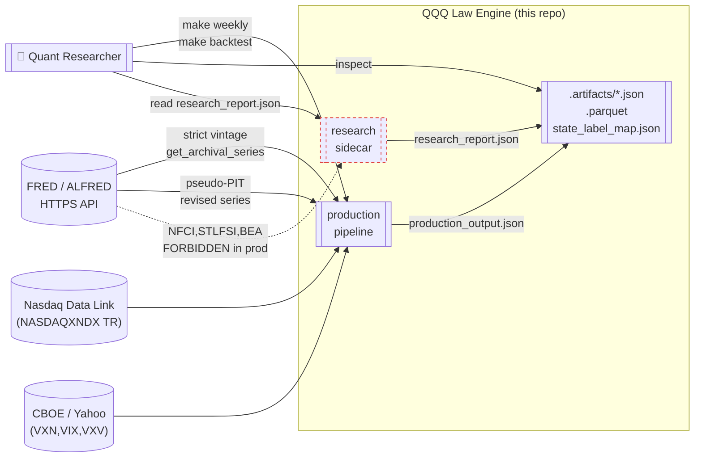

### 2.2 Container 图（C4 第 2 层）

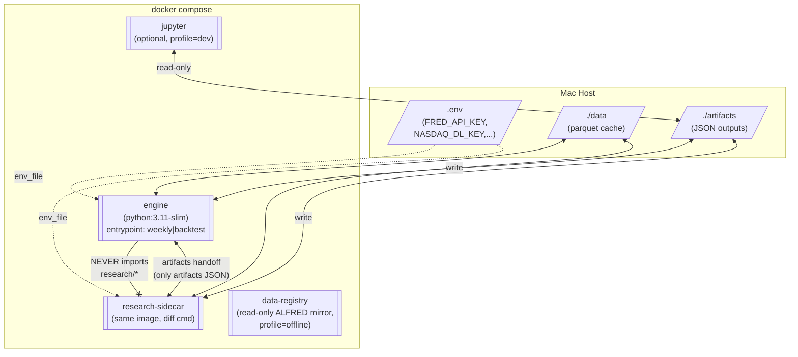

### 2.3 顶层风格——Functional Core / Imperative Shell

```mermaid
flowchart LR
    subgraph shell["Imperative Shell (边界层，副作用允许)"]
        direction TB
        io_fred["fred_client.py<br/>io: http"]
        io_fs["artifacts.py<br/>io: fs"]
        io_log["logging.py<br/>io: stderr"]
        cfg["config_loader.py<br/>io: yaml read"]
        cli["cli.py / entrypoints<br/>io: argv,exit"]
    end

    subgraph core["Functional Core (纯函数，无副作用)"]
        direction TB
        pure_features["features/scaling.py<br/>block_builder.py<br/>pca.py<br/>(pure)"]
        pure_state["state/ti_hmm_single.py<br/>state_label_map.py<br/>(pure)"]
        pure_law["law/linear_quantiles.py<br/>tail_extrapolation.py<br/>quantile_moments.py<br/>(pure)"]
        pure_decision["decision/*.py<br/>(pure)"]
        pure_bt["backtest/walkforward.py<br/>block_bootstrap.py<br/>metrics.py<br/>(pure)"]
    end

    shell -- "dataclass (frozen)<br/>只传入不可变数据" --> core
    core -- "返回新 dataclass<br/>不修改入参" --> shell

    classDef sh fill:#fde5d1,stroke:#e27
    classDef co fill:#d1e5fd,stroke:#27e
    class shell sh
    class core co
```

**硬约束（`MUST`，CI 门禁）**：

- `src/features/`、`src/state/`、`src/law/`、`src/decision/`、`src/backtest/` 下**不得**出现 `open(`、`requests.`、`httpx.`、`print(`、`logging.`、`datetime.now`、`time.time`、`os.environ`、`random.` 任意一处（随机性通过显式 `rng: np.random.Generator` 参数注入）。
- 上述纯核模块**不得**声明全局可变状态（`global`、模块级可变 `list/dict`、`@lru_cache` 依赖不可变 key 除外）。
- 所有跨模块数据对象使用 `@dataclass(frozen=True, slots=True)` 或 `pydantic.BaseModel(frozen=True)`；禁止通过方法修改 `self`。

上述规则由 `tests/test_fp_purity.py`（AST grep + import linter）强制执行。

---

## 3. 分层架构与 FP 纯核边界

### 3.1 五层模型

| 层          | 目录                 | 副作用 | 职责                                                                 |
| ----------- | -------------------- | ------ | -------------------------------------------------------------------- |
| L1 Adapter  | `src/data_contract/` | 有     | 外部 API → 内部 `Frame` / `TimeSeries`；PIT 校验；缓存               |
| L2 Domain   | `src/features/`、`src/state/`、`src/law/`、`src/decision/` | **无** | 全部纯函数；输入 `FeatureFrame` → 输出 `QuantileOutput`/`DecisionOutput` |
| L3 Use-case | `src/backtest/`、`src/inference/` | **无** | 组合 domain 算子、walk-forward 循环（循环本身是纯的，I/O 在上下层） |
| L4 App      | `src/app/` (cli, scheduler) | 有     | 解析命令行、读 `.env`、调用 adapter 拉数据、调用 use-case 计算、写 artifacts |
| L5 Deliver  | `src/research/`, `artifacts/` | 有     | 研究 sidecar 产出、JSON 出稿                                         |

### 3.2 依赖方向

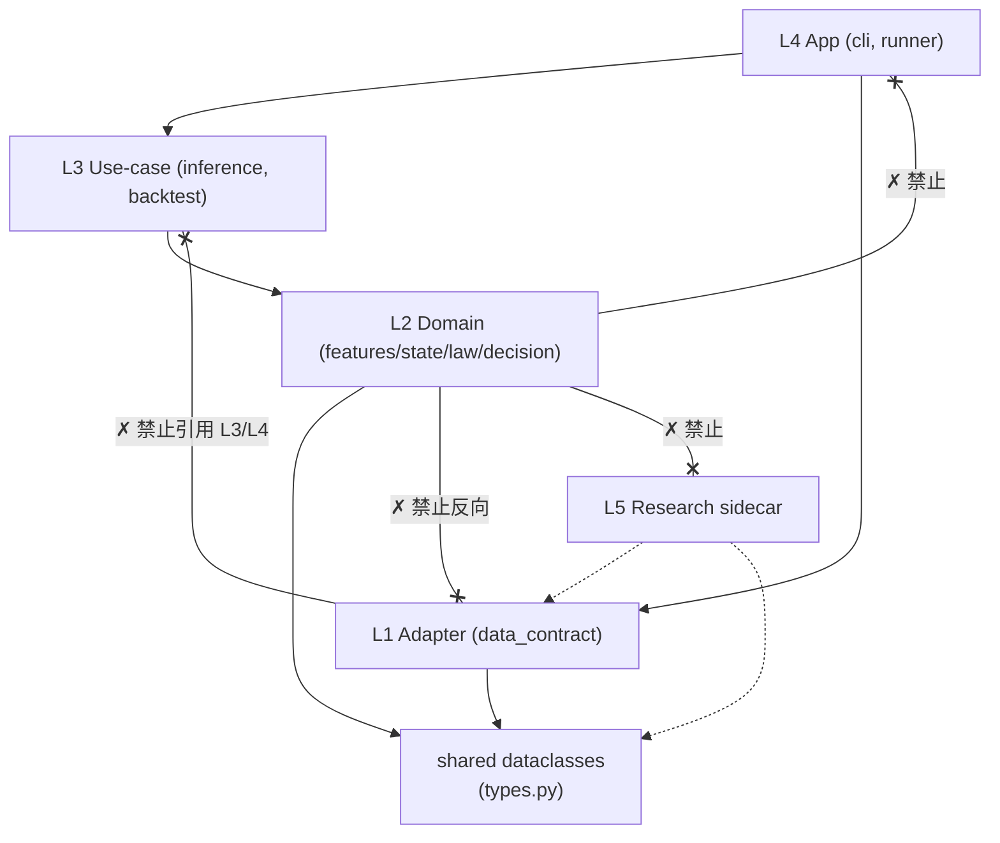

`MUST NOT`（`tests/test_layer_boundaries.py` 用 `importlab` 或 `pydeps` 断言）：

- `src/features/**.py` 不得 `import src.data_contract`、`import src.backtest`、`import src.app`；
- `src/state/**.py`、`src/law/**.py`、`src/decision/**.py` 同上；
- `src/backtest/**.py` 不得 `import src.app`；
- `src/**` 任何非 `src/research/` 下的文件不得 `import src.research`（SRD §17-#10 硬要求）。

### 3.3 核心数据类型（单一真源）

`src/types.py`（L2 共享，**不得**依赖其他 src 模块）：

```python
# src/types.py — frozen dataclasses only. No methods with side effects.
from __future__ import annotations
from dataclasses import dataclass
from datetime import date
from typing import Literal, Mapping, Sequence
import numpy as np

VintageMode = Literal["strict", "pseudo"]
Mode = Literal["NORMAL", "DEGRADED", "BLOCKED"]
Stance = Literal["DEFENSIVE", "NEUTRAL", "OFFENSIVE"]

@dataclass(frozen=True, slots=True)
class SeriesPITRequest:
    series_id: str
    as_of: date
    vintage_mode: VintageMode

@dataclass(frozen=True, slots=True)
class TimeSeries:
    series_id: str
    timestamps: np.ndarray   # dtype=datetime64[ns], weekly Friday close
    values: np.ndarray       # dtype=float64, same len
    is_pseudo_pit: bool

@dataclass(frozen=True, slots=True)
class FeatureFrame:
    as_of: date
    x_raw: np.ndarray        # shape (T, 10)  float64
    x_scaled: np.ndarray     # shape (T, 10)  float64 in [-5, 5]
    pc: np.ndarray           # shape (T, 2)
    h: np.ndarray            # shape (T,)
    mask_missing: np.ndarray # shape (T, 10) bool

@dataclass(frozen=True, slots=True)
class HMMPosterior:
    post: np.ndarray          # shape (3,), sums to 1
    state_name: Stance
    dwell_weeks: int
    hazard_covariate: float
    status: Literal["ok", "degenerate", "em_nonconverge"]

@dataclass(frozen=True, slots=True)
class QuantileCurve:
    taus: tuple[float, ...]   # (0.05, 0.10, 0.25, 0.50, 0.75, 0.90, 0.95)
    values: np.ndarray        # shape (7,)
    ci_low: Mapping[str, float]   # {"q05":..., "q95":...}
    ci_high: Mapping[str, float]
    solver_status: Literal["ok", "rearranged", "failed"]
    tail_status: Literal["ok", "fallback"]

@dataclass(frozen=True, slots=True)
class DecisionBundle:
    excess_return: float
    utility: float
    offense_raw: float
    offense_final: float
    stance: Stance
    cycle_position: float

@dataclass(frozen=True, slots=True)
class WeeklyOutput:
    as_of_date: date
    srd_version: Literal["8.7"]
    mode: Mode
    vintage_mode: VintageMode
    hmm: HMMPosterior
    quantiles: QuantileCurve
    decision: DecisionBundle
    diagnostics: Mapping[str, float | str]
```

> **注**: `WeeklyOutput` 的 JSON 序列化由 `src/app/output_serializer.py` 执行，该文件位于 L4（shell），纯核不承担 JSON 编解码。

---

## 4. 数据架构与点时契约（PIT）

### 4.1 数据资产清单

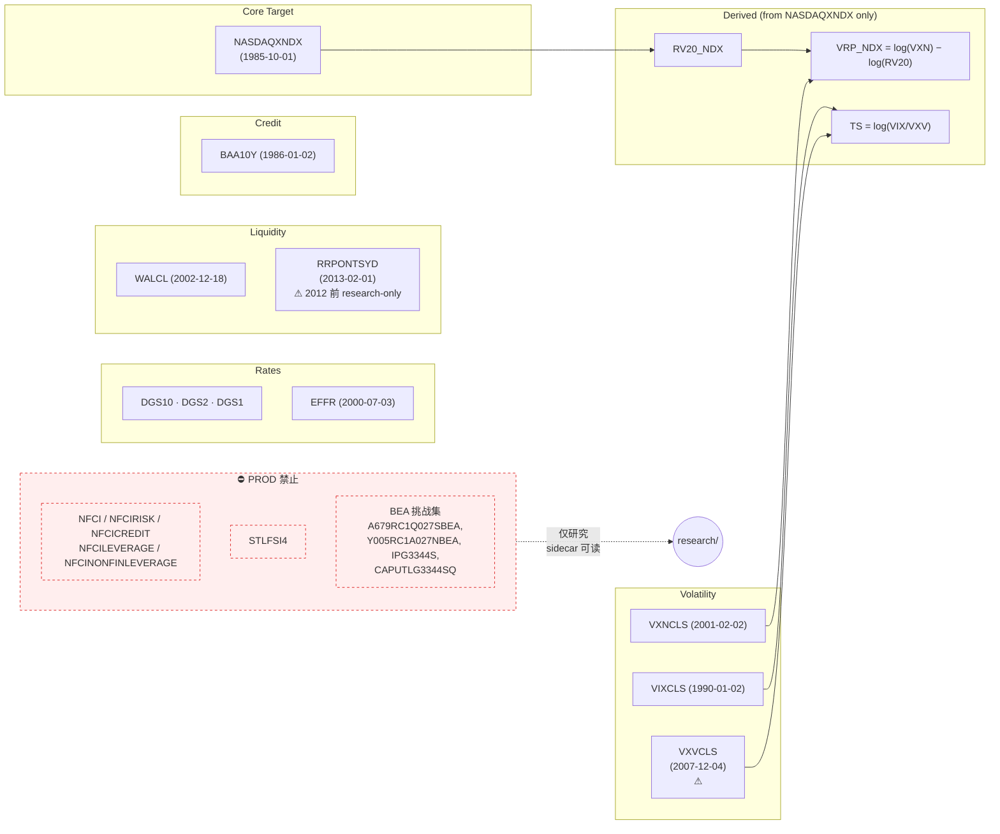

### 4.2 Vintage Registry 硬编码表

`src/data_contract/vintage_registry.py`：

```python
# src/data_contract/vintage_registry.py
# SRD §4.3 earliest_strict_pit table — frozen.
from __future__ import annotations
from dataclasses import dataclass
from datetime import date
from typing import Mapping

@dataclass(frozen=True, slots=True)
class VintageSpec:
    series_id: str
    earliest_strict_pit: date
    note: str

REGISTRY: Mapping[str, VintageSpec] = {
    "NASDAQXNDX": VintageSpec("NASDAQXNDX", date(1985, 10, 1), "daily close, no revision"),
    "DGS10":      VintageSpec("DGS10",      date(1962, 1, 2),  "daily"),
    "DGS2":       VintageSpec("DGS2",       date(1976, 6, 1),  "daily"),
    "DGS1":       VintageSpec("DGS1",       date(1962, 1, 2),  "daily; risk-free"),
    "EFFR":       VintageSpec("EFFR",       date(2000, 7, 3),  "daily"),
    "WALCL":      VintageSpec("WALCL",      date(2002, 12, 18),"weekly H.4.1"),
    "RRPONTSYD":  VintageSpec("RRPONTSYD",  date(2013, 2, 1),  "pre-date: research-only"),
    "BAA10Y":     VintageSpec("BAA10Y",     date(1986, 1, 2),  "computed spread"),
    "VXNCLS":     VintageSpec("VXNCLS",     date(2001, 2, 2),  "pre-date: not usable"),
    "VIXCLS":     VintageSpec("VIXCLS",     date(1990, 1, 2),  "daily"),
    "VXVCLS":     VintageSpec("VXVCLS",     date(2007, 12, 4), "pre-date: research-only"),
}

# 生产路径禁读集（SRD §4.2）
FORBIDDEN_IN_PROD: frozenset[str] = frozenset({
    "NFCI", "NFCIRISK", "NFCICREDIT", "NFCILEVERAGE", "NFCINONFINLEVERAGE",
    "STLFSI4",
    "A679RC1Q027SBEA", "Y005RC1A027NBEA", "IPG3344S", "CAPUTLG3344SQ",
})
```

配套测试：`tests/test_vintage_registry.py` 逐条断言上表。

### 4.3 PIT 取数协议

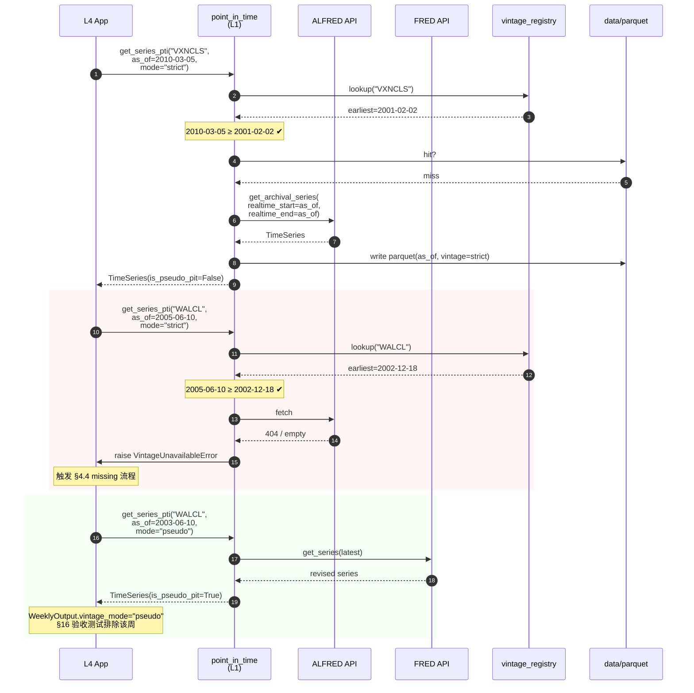

### 4.4 数据链路与契约执行

```mermaid
flowchart LR
    raw["raw<br/>(parquet, 原始 FRED/ALFRED<br/>payload)"]
    contract["contract layer<br/>point_in_time.py"]
    ts["TimeSeries<br/>(L2 type)"]
    feat["FeatureFrame<br/>(10 列 + mask)"]
    scaled["X^z<br/>(-5,5 clipped)"]
    hmm_obs["HMM observation y_t<br/>(6 列: pc1,pc2,Δpc1,Δpc2,x8,x9)"]
    π["π_t ∈ ℝ³"]
    Q["QuantileCurve"]
    D["DecisionBundle"]
    out["WeeklyOutput JSON"]

    raw -- "ALFRED<br/>get_archival_series" --> contract
    contract -- "PIT enforce<br/>vintage_registry 校验" --> ts
    ts -- "block_builder.py §6" --> feat
    feat -- "scaling.py §5.1 + §5.2" --> scaled
    scaled -- "pca.py (robust, 扩展窗口)" --> hmm_obs
    hmm_obs -- "ti_hmm_single.py §7" --> π
    scaled -- "passthrough" --> Q
    π --> Q
    Q -- "linear_quantiles.py §8.1" --> Q
    Q -- "tail_extrapolation.py §8.2" --> Q
    Q -- "quantile_moments.py §9.1" --> D
    π --> D
    D -- "utility.py §9.3<br/>offense_abs.py §9.4<br/>hysteresis.py §9.5<br/>cycle_position.py §9.7" --> D
    D -- "output_serializer.py<br/>(L4 shell)" --> out

    classDef l1 fill:#fde5d1
    classDef l2 fill:#d1e5fd
    classDef l4 fill:#d1fde5
    class raw,contract l1
    class ts,feat,scaled,hmm_obs,π,Q,D l2
    class out l4
```

### 4.5 缓存与目录布局

```
data/
  raw/
    alfred/{series_id}/asof={YYYY-MM-DD}.parquet    # 原始 vintage 响应，不可修改
    fred/{series_id}/latest.parquet                 # pseudo 模式缓存
    nasdaq/{series_id}/close.parquet
  processed/
    features/asof={YYYY-MM-DD}.parquet              # 10 列 x_raw
    scaled/asof={YYYY-MM-DD}.parquet                # x_scaled ∈ [-5,5]
artifacts/
  weekly/{YYYY-MM-DD}/production_output.json
  weekly/{YYYY-MM-DD}/research_report.json
  training/
    state_label_map.json                            # §7.2
    utility_zstats.json                             # §9.3
    offense_thresholds.json                         # §9.4
  backtest/
    strict_pit/metrics.parquet
    pseudo_pit/metrics.parquet
    acceptance_report.json
```

- `data/raw/alfred/**` **MUST NOT** 被覆盖写（append-only 审计）；由 `src/data_contract/cache.py` 的 `WriteOnceFS` 强制。
- `data/processed/**`、`artifacts/**` 均可在日更时重算，但重算结果必须字节一致（确定性种子，见 §8.3）。

### 4.6 数据真实性门禁（禁止造假）

AI coding agent **MUST NOT** 做以下任何一项（CI 强制）：

| 禁令 | 检测方式 |
| ---- | -------- |
| 在测试或示例外生成随机「市场数据」冒充真实 FRED payload | `grep -R "np.random.*NASDAQXNDX\|mock.*fred\|fake.*series" src/` 无命中（研究 sidecar 可用合成数据做单元测试，但标记 `@pytest.mark.synthetic`） |
| 在 `strict` 模式下 silently fallback 到 `pseudo` | `point_in_time.py` 必须 raise；`tests/test_point_in_time.py::test_strict_no_silent_fallback` |
| 在数据缺失时用前后值插值（跨时间）                 | `block_builder.py` 内 `grep .interpolate\|.fillna(method=` 无命中 |
| 用 revised series 回填 pre-vintage 历史            | `WriteOnceFS` 禁止覆盖 `raw/alfred/**` |
| 将研究路径计算结果以生产字段名写入 production JSON | `tests/test_research_isolation.py` |

### 4.7 两段式回测窗口

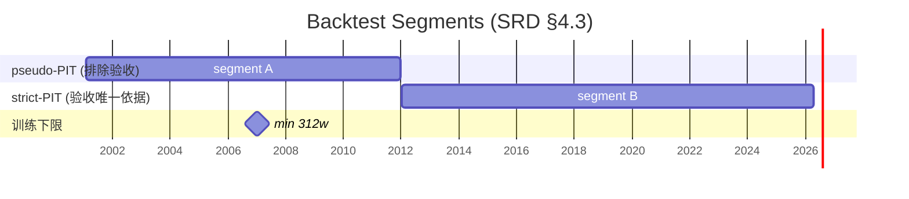

验收统计仅读 `artifacts/backtest/strict_pit/metrics.parquet`；`pseudo_pit/*` 仅作诊断。`backtest/acceptance.py` 启动时检查输入路径，误读 pseudo 即 raise。

---

## 5. 计算管道架构

### 5.1 端到端组件图

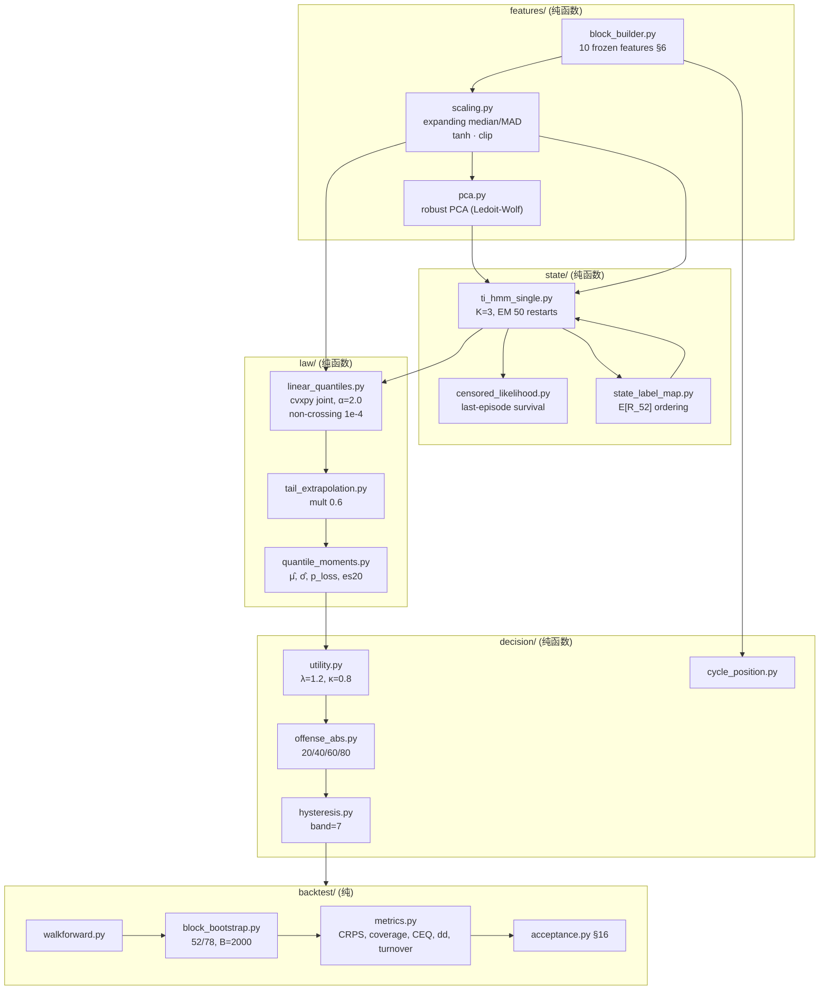

### 5.2 每周推断序列图

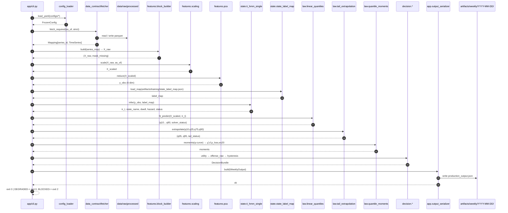

### 5.3 Walk-forward 回测序列图

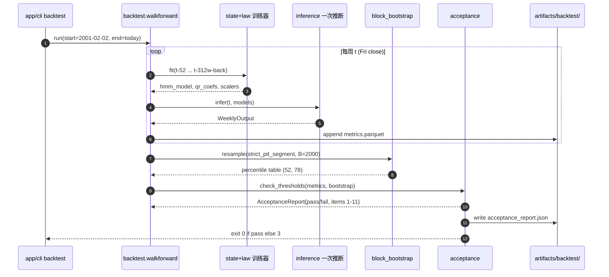

### 5.4 HMM 状态语义与标签冻结

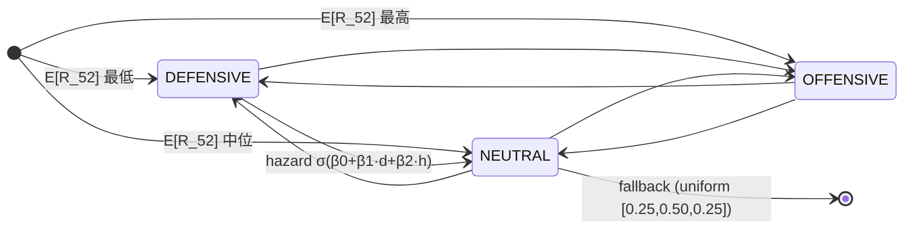

- 标签映射在训练时按在样本内 52 周平均前向收益**升序**排序冻结，写 `artifacts/training/state_label_map.json`；
- 每次推断 `MUST` 读取该 JSON，不允许重新排序；
- `tests/test_state_label_map.py::test_identical_across_runs`：两个独立种子训练后的 label map 字节一致。

### 5.5 分位曲线与尾部外推

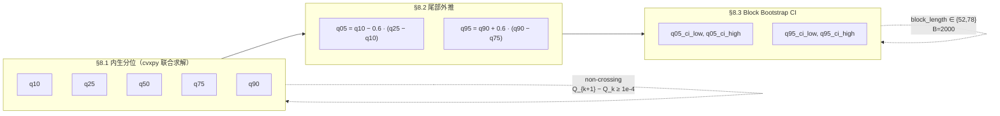

**求解器失败回退**（§8.1）：

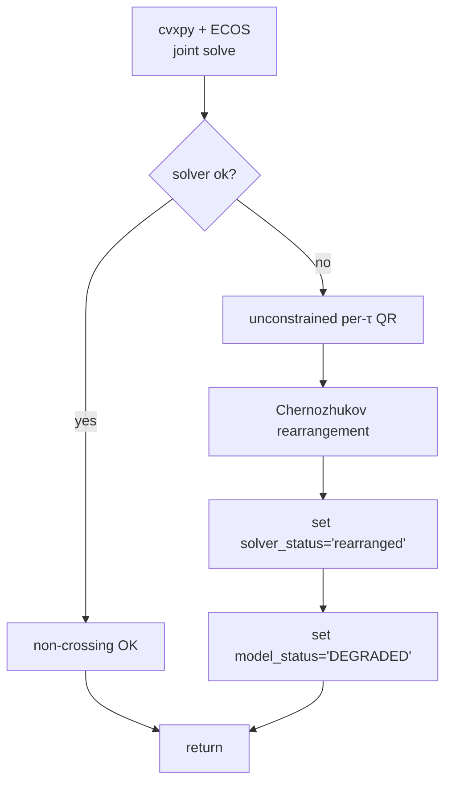

### 5.6 Offense 映射（绝对阈值）

```mermaid
flowchart LR
    U["U_t"] --> C{U_t vs thresholds<br/>u_q20,u_q40,u_q60,u_q80<br/>(训练期冻结)}
    C -->|< u_q20| B1["[0,20]"]
    C -->|[u_q20,u_q40)| B2["[20,40]"]
    C -->|[u_q40,u_q60)| B3["[40,60]"]
    C -->|[u_q60,u_q80)| B4["[60,80]"]
    C -->|≥ u_q80| B5["[80,100]"]
    B1 & B2 & B3 & B4 & B5 --> clip["clip [0,100]"]
    clip --> H["hysteresis band=7"]
    H --> S{stance?}
    S -->|≤35| DEF[DEFENSIVE]
    S -->|35<·<65| NEU[NEUTRAL]
    S -->|≥65| OFF[OFFENSIVE]
```

---

## 6. 运行时与容器架构

### 6.1 Docker Compose 拓扑

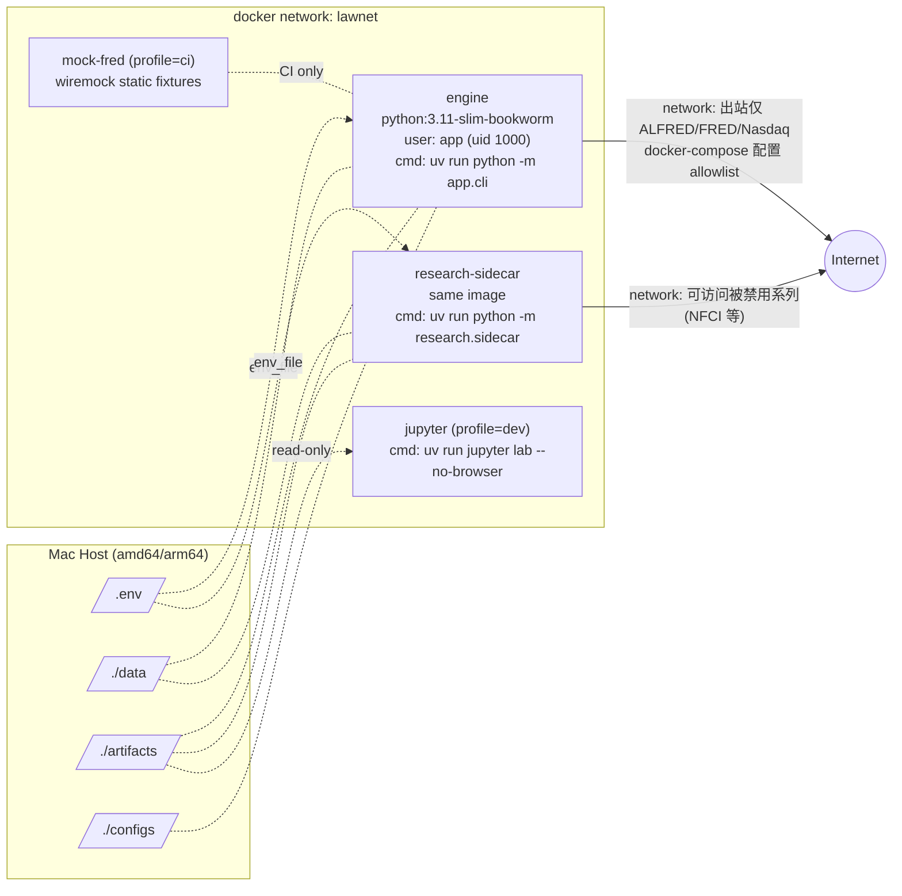

### 6.2 `docker-compose.yml` 关键结构

```yaml
# 要点仅列出，完整文件见 repo 根 docker-compose.yml
services:
  engine:
    build: { context: ., target: runtime }
    image: qqq-law-engine:dev
    env_file: [.env]
    environment:
      RUN_MODE: ${RUN_MODE:-weekly}        # weekly | backtest | train
      SRD_VERSION: "8.7"
    volumes:
      - ./data:/app/data
      - ./artifacts:/app/artifacts
      - ./configs:/app/configs:ro
    read_only: true                        # 只允许写 /app/data /app/artifacts
    tmpfs: [/tmp]
    user: "1000:1000"
    networks: [lawnet]

  research-sidecar:
    image: qqq-law-engine:dev
    env_file: [.env]
    environment:
      RUN_MODE: research
    command: ["uv", "run", "python", "-m", "research.sidecar"]
    depends_on: { engine: { condition: service_completed_successfully } }
    volumes:
      - ./data:/app/data:ro                # sidecar 只读 data
      - ./artifacts:/app/artifacts
    networks: [lawnet]
```

- `read_only: true` 保障生产容器无法在非预期路径写入（防造假）；
- sidecar 对 `/app/data` 只读，禁止回写原始数据；
- 两个容器共用同一镜像 tag，但通过 `RUN_MODE` 切换入口。

### 6.3 Dockerfile 多阶段策略

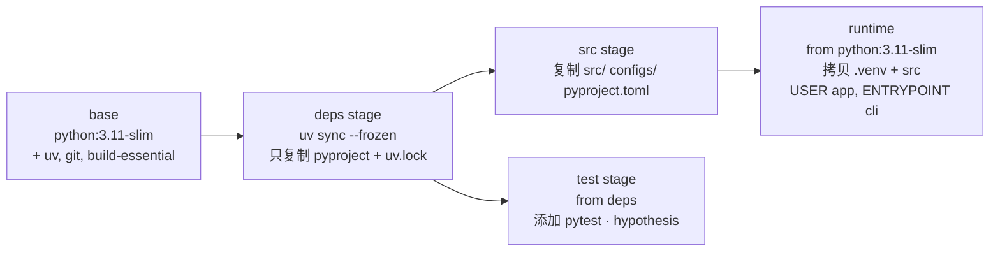

理由：

- 依赖层独立缓存，源码变更不会使依赖层失效（构建快 10x）；
- `runtime` 层不含编译器、git、缓存，攻击面小；
- `test` 层用于 CI，本地不下发。

### 6.4 `.env` 契约

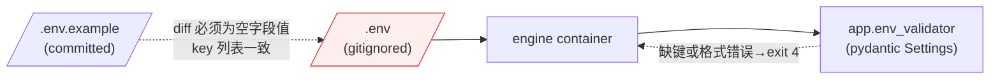

必需键（仅 4 项，最小凭据集）：

| 键                   | 用途                             | 必需?           |
| -------------------- | -------------------------------- | --------------- |
| `FRED_API_KEY`       | FRED / ALFRED                    | ✔               |
| `NASDAQ_DL_API_KEY`  | `NASDAQXNDX` 总回报              | ✔               |
| `CBOE_TOKEN`         | VXN/VIX/VXV 真实历史来源（可选） | ✔（或公开 CSV 镜像） |
| `TZ`                 | 容器时区                          | 默认 `America/New_York` |

> **`.env.example` 必须提交**，**`.env` 必须入 `.gitignore`**；`tests/test_env_contract.py` 校验二者键一致。

### 6.5 运行模式表

| 模式         | 入口命令                                                | 容器            | 退出码语义                          |
| ------------ | ------------------------------------------------------- | --------------- | ----------------------------------- |
| `weekly`     | `uv run python -m app.cli weekly --as-of FRIDAY`         | engine          | 0=NORMAL/DEGRADED, 2=BLOCKED, 4=env |
| `backtest`   | `uv run python -m app.cli backtest --start --end`        | engine          | 0=通过, 3=验收失败                   |
| `train`      | `uv run python -m app.cli train --window 312w`           | engine          | 0=模型写盘成功                       |
| `research`   | `uv run python -m research.sidecar`                      | research-sidecar | 0=report 成功, 1=崩溃                |
| `verify`     | `uv run python -m app.cli verify --as-of FRIDAY`         | engine          | 0=哈希一致, 5=哈希不一致             |

### 6.6 可复现性（Determinism）

| 维度           | 措施                                                                                            |
| -------------- | ----------------------------------------------------------------------------------------------- |
| 依赖           | `uv.lock` 提交；`docker build` 使用 `--frozen`；基础镜像按 digest 锁定                          |
| 数值计算       | 所有随机性显式 `rng: np.random.Generator = default_rng(seed)`；`seed` 在 `configs/base.yaml` 中 |
| HMM EM 初值    | 50 restarts 的每个 seed 为 `seed_base + k`，确定性可重放                                        |
| Bootstrap      | `block_bootstrap(rng=default_rng(seed_bootstrap))`；`seed_bootstrap` 冻结                       |
| 浮点环境       | `np.seterr(all='raise')`；禁用 `OMP_NUM_THREADS` 非 1 的模糊性，CI 中固定 `OMP_NUM_THREADS=1`    |
| JSON 序列化    | `orjson` with sorted keys + `OPT_SERIALIZE_NUMPY`；同输入同输出字节级一致                       |
| 时间           | 容器时区固定 `America/New_York`；`as_of` 由 CLI 传入，绝不用 `datetime.now()`                   |

`tests/test_determinism.py` 运行两次 `weekly --as-of 2023-10-27`，断言 JSON 字节一致。

---

## 7. 测试架构

### 7.1 测试分层与金字塔

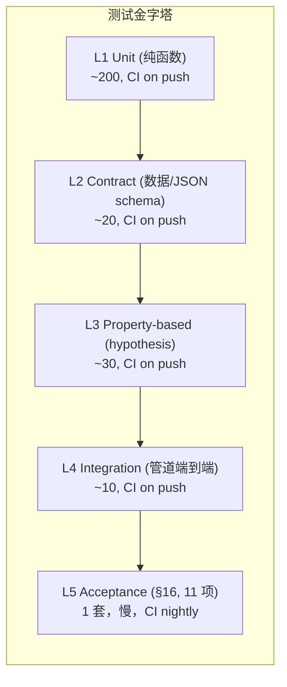

### 7.2 「禁止造轮子」同源约束

这是 **本架构最重要的测试原则**。若测试代码独立实现一份「参照版」算法（另写一个 HMM、另写一个 quantile 求解器），则：

1. 测试和主引擎的错误会同时被盖住；
2. 研究路径和生产路径的防火墙被绕过；
3. 未来 SRD 版本升级时两套实现会漂移。

**MUST**（CI 强制）：

- 所有 L1 单元测试 **仅**可 import `src.*` 下的纯函数；不得实现同等功能的「reference implementation」。
- 性质测试（hypothesis）只写断言不写算法：例如 `assert is_non_crossing(curve)`、`assert q05 ≤ q10 ≤ ... ≤ q95`、`assert sum(hmm_post) ≈ 1`；**不要**在测试里再写一遍 quantile rearrangement。
- 黄金样本测试用 **冻结的真实历史数据**（见 §7.3）。不允许生成合成数据冒充。
- 跨模块集成测试通过 **同一 cli 入口** 触发，读的是 `src/app/cli.py` 的实际代码路径，不允许在测试里手搓一套「mini cli」。

**检测**：

```bash
# tests/test_antipatterns.py 执行
ast-grep --pattern 'def _reference_$X' tests/    # 禁止 _reference_* 私实现
python tools/no_parallel_impl.py                 # 比较 src/law vs tests/law 模块签名集合
```

### 7.3 黄金样本（Golden Snapshot）

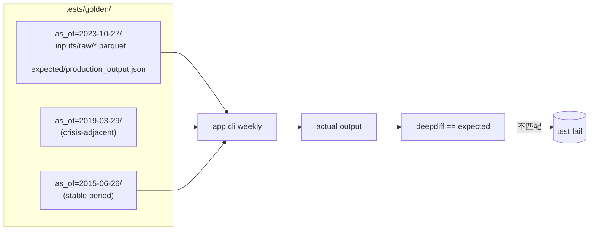

金样本由 **一次真实的 ALFRED 拉数** 生成；之后 CI 离线模式回放（见 §6.1 `mock-fred`）。任何算法/常量修改若导致 JSON 差异，**PR 必须显式提交新金样本** 作为证据。

### 7.4 Property-based 测试清单（核心断言）

| 模块                           | 断言性质                                                             |
| ------------------------------ | -------------------------------------------------------------------- |
| `features/scaling.py`          | `|x_scaled| ≤ 5` 全域；tanh 单调保序                                 |
| `features/block_builder.py`    | 输入含 NaN → 对应 `mask_missing[t,i]=True`，不插值                    |
| `state/ti_hmm_single.py`       | `sum(post)∈[1−1e-9, 1+1e-9]`；`hmm.infer` 对 seed 等同输出           |
| `state/state_label_map.py`     | 训练两次，map 完全相同（bytes-equal）                                |
| `law/linear_quantiles.py`      | 输出满足 `q_{k+1} − q_k ≥ 1e-4`（SRD §8.1）                           |
| `law/tail_extrapolation.py`    | `q05 ≤ q10 ∧ q95 ≥ q90`；pathological 时触发 fallback status          |
| `decision/utility.py`          | 使用训练期冻结 z-stats，而非滚动窗口                                 |
| `decision/hysteresis.py`       | `|offense_final_t − offense_final_{t-1}| ∈ {0} ∪ [band, ∞)`           |
| `backtest/block_bootstrap.py`  | B 次采样中 **任一周** 被采中的经验频率 → `1/n_weeks`（大数定律）      |
| `data_contract/point_in_time` | strict 模式下，请求 `as_of < earliest_strict_pit` **必然** raise      |

### 7.5 Research 隔离测试

`tests/test_research_isolation.py`（SRD §17-#10）：

```python
def test_production_never_imports_research():
    import ast, pathlib
    forbidden = "research"
    for p in pathlib.Path("src").rglob("*.py"):
        if p.parts[1] == "research":
            continue
        tree = ast.parse(p.read_text())
        for node in ast.walk(tree):
            if isinstance(node, ast.ImportFrom):
                assert node.module is None or not node.module.startswith(forbidden), (
                    f"{p}: illegal import of research.*"
                )
```

### 7.6 测试与主引擎的代码路径重叠率（覆盖率 ≠ 同源率）

我们定义 `overlap_ratio = (测试期间被调用的 src 下函数数) / (src 下公共函数总数)`。CI 门禁 `overlap_ratio ≥ 0.95`。

```mermaid
flowchart LR
    tests((tests/)) -- "import src.*" --> src((src/))
    tests -. "不得 reimplement<br/>不得 mock 纯函数" .- tests
    src -- "被 pytest --cov=src 覆盖" --> coverage[coverage.xml]
    coverage -- "overlap ≥ 0.95" --> gate[CI gate]
```

允许 mock 的仅限 L1 Adapter（FRED HTTP 调用），纯核一律不得 mock。

---

## 8. 可观测性与 artifacts 契约

### 8.1 日志策略

```mermaid
flowchart LR
    subgraph shell_io["L1/L4 允许日志"]
        log_l1["data_contract logging:<br/>INFO api_call, cache_hit<br/>WARN vintage_missing"]
        log_l4["app logging:<br/>INFO weekly_start/end<br/>ERROR exit codes"]
    end
    subgraph core_silent["L2/L3 禁止 logging"]
        note["纯核绝不写日志；<br/>诊断以返回值字段暴露<br/>(hmm_status, solver_status)"]
    end

    shell_io -- "structlog JSON 行<br/>stderr" --> collector[(stderr<br/>→ docker logs)]
    core_silent -. "纯函数" .- shell_io
```

字段约定：`{ts, level, event, as_of, series_id, mode, vintage_mode, corr_id}`。

### 8.2 Artifacts 签名与审计

```
artifacts/weekly/2026-04-17/
  production_output.json
  production_output.json.sha256           # 字节 hash，供 verify 模式比对
  inputs_manifest.json                    # 哪些 raw/* 被读，哈希
  env_fingerprint.json                    # uv.lock hash + 镜像 digest + srd_version
```

- `make verify --as-of ...` 重新运行并比对 `.sha256`；不一致即 exit 5；
- `inputs_manifest.json` 是「这一周用了哪些原始数据」的唯一证据，审计追溯必读；
- CI 对每个 PR 自动在金样本上 `make verify`，禁止静默漂移。

### 8.3 Training artifacts 契约

| 文件                                        | 写入方                     | 读取方                       | 变更规则                  |
| ------------------------------------------- | -------------------------- | ---------------------------- | ------------------------- |
| `artifacts/training/state_label_map.json`   | `app.cli train`            | `state.ti_hmm_single.infer`  | SRD §7.2，一次训练永久冻结 |
| `artifacts/training/utility_zstats.json`    | `app.cli train`            | `decision.utility`           | SRD §9.3                   |
| `artifacts/training/offense_thresholds.json`| `app.cli train`            | `decision.offense_abs`       | SRD §9.4                   |

重训训练 artifact 需提交 `TRAINING_CHANGELOG.md` 条目并打 git tag `train-YYYYMMDD`；推断容器启动时检查 tag，不一致则 exit 6。

---

## 9. CI/CD 架构

### 9.1 Pipeline 概览

```mermaid
flowchart LR
    push["push / PR"] --> lint
    subgraph gates["CI 门禁 (并行)"]
        lint["lint (ruff)"]
        type["mypy --strict"]
        purity["FP purity<br/>(layer boundaries,<br/>no io in core)"]
        research_fw["research firewall<br/>(import linter)"]
        unit["pytest L1-L3"]
        env_c["env contract"]
    end
    lint --> integ
    type --> integ
    purity --> integ
    research_fw --> integ
    unit --> integ
    env_c --> integ
    integ["integration L4<br/>(docker compose up +<br/>golden snapshot)"]
    integ --> accept
    accept["acceptance nightly<br/>(§16 on strict-PIT)"]
    accept --> release
    release["tag vX.Y.Z →<br/>docker push ghcr.io/..."]
    integ --> deterministic["determinism<br/>(run twice, bytes-equal)"]
```

### 9.2 Jobs 详表

| Job                     | 触发     | 命令                                                              | 门禁 |
| ----------------------- | -------- | ----------------------------------------------------------------- | ---- |
| `lint`                  | push/PR  | `uv run ruff check .` + `uv run ruff format --check .`             | 必过 |
| `type`                  | push/PR  | `uv run mypy --strict src/ tests/`                                 | 必过 |
| `fp-purity`             | push/PR  | `uv run pytest tests/test_fp_purity.py tests/test_layer_boundaries.py` | 必过 |
| `research-firewall`     | push/PR  | `uv run pytest tests/test_research_isolation.py`                   | 必过 |
| `unit`                  | push/PR  | `uv run pytest -q -m 'not acceptance and not slow'`                | 必过 |
| `env-contract`          | push/PR  | `uv run pytest tests/test_env_contract.py`                         | 必过 |
| `integration`           | push/PR  | `docker compose --profile ci up --abort-on-container-exit engine mock-fred` + 金样本 diff | 必过 |
| `determinism`           | push/PR  | `make weekly-twice-diff`                                           | 必过 |
| `acceptance`            | nightly + tag | `uv run pytest -m acceptance`（§16 strict-PIT）               | 必过（tag 必过） |
| `container-scan`        | push     | `trivy image qqq-law-engine:dev`                                   | warn |
| `release`               | tag `v*` | 构建并推送多架构镜像 ghcr                                          | -    |

### 9.3 Workflow 文件拓扑

```
.github/
  workflows/
    ci.yml                 # push / pull_request: lint/type/purity/unit/integration/determinism
    research-firewall.yml  # push / pull_request: 专职 research 防火墙 + import linter
    acceptance.yml         # schedule: nightly §16
    release.yml            # tag v*: build & push image, create GitHub Release
  pull_request_template.md # SRD/ADD conflict check box + deviation-note
  CODEOWNERS
```

每个 workflow 在 §9.5 与输出物中展开。

### 9.4 门禁矩阵（按 SRD 章节）

| SRD 要求                       | 门禁测试                                        | 所在 workflow |
| ------------------------------ | ----------------------------------------------- | ------------- |
| §4.3 vintage registry 硬编码   | `test_vintage_registry.py`                      | ci.yml unit   |
| §4.3 strict/pseudo 两种模式    | `test_point_in_time.py`                         | ci.yml unit   |
| §5.2 soft squash + hard clip   | `test_scaling.py` (property)                    | ci.yml unit   |
| §6 10 个冻结特征               | `test_feature_block.py`                         | ci.yml unit   |
| §7 单 HMM + label map 冻结     | `test_ti_hmm_single.py`, `test_state_label_map.py` | ci.yml unit   |
| §8.1 non-crossing 1e-4         | `test_linear_quantiles.py` (property)           | ci.yml unit   |
| §8.2 mult=0.6 尾部             | `test_tail_extrapolation.py`                    | ci.yml unit   |
| §9.3 训练冻结 z-stats          | `test_utility.py`                               | ci.yml unit   |
| §9.4 绝对阈值映射              | `test_offense_abs.py`                           | ci.yml unit   |
| §9.5 hysteresis band=7         | `test_hysteresis.py`                            | ci.yml unit   |
| §15.2 block bootstrap          | `test_block_bootstrap.py`                       | ci.yml unit   |
| §16 验收 11 项                 | `test_acceptance.py`                            | acceptance.yml |
| §17 生产不得 import research   | `test_research_isolation.py`                    | research-firewall.yml |

### 9.5 发布流程

```mermaid
flowchart LR
    merge["main merge<br/>(CI 全绿)"] --> tag["tag v8.7.x"]
    tag --> build_multiarch["buildx --platform<br/>linux/amd64,linux/arm64"]
    build_multiarch --> sign["cosign sign<br/>(keyless OIDC)"]
    sign --> push["ghcr.io/org/qqq-law-engine:v8.7.x"]
    push --> accept_release["acceptance.yml 触发<br/>(release 前必过)"]
    accept_release --> release_page["GitHub Release<br/>附 acceptance_report.json"]
```

---

## 10. 失效、降级与熔断

### 10.1 模式状态机

```mermaid
stateDiagram-v2
    [*] --> NORMAL
    NORMAL --> DEGRADED: missing ∈ [10%,20%]<br/>或 hmm/solver 回退<br/>或 tail fallback
    DEGRADED --> NORMAL: 下一周恢复
    NORMAL --> BLOCKED: missing>20%<br/>或块级两周缺失<br/>或 U/offense NaN
    DEGRADED --> BLOCKED
    BLOCKED --> NORMAL: 数据恢复
    BLOCKED --> DEGRADED
```

- DEGRADED：`offense_final` 夹紧到 `[30,70]`（SRD §10）；
- BLOCKED：`offense_final=50, stance=NEUTRAL`；
- 无 `HALT`——engine 仍输出 JSON，由下游（人类审计）决定是否行动。

### 10.2 退出码语义统一表

| 退出码 | 语义                           | 谁看它                             |
| ------ | ------------------------------ | ---------------------------------- |
| 0      | NORMAL / DEGRADED / ACCEPT PASS | CI, cron scheduler                  |
| 2      | BLOCKED                        | alerting（周 run 持续 BLOCKED 两周） |
| 3      | ACCEPTANCE FAIL                | release.yml gate                    |
| 4      | ENV 合约破坏                   | 用户首次启动                        |
| 5      | VERIFY 哈希不一致              | 审计                                |
| 6      | TRAINING ARTIFACT 版本不匹配   | 推断容器启动                        |

---

## 11. 研究-生产防火墙

### 11.1 目录硬隔离

```mermaid
flowchart TB
    subgraph src["src/"]
        prod_modules["features/<br/>state/<br/>law/<br/>decision/<br/>backtest/<br/>data_contract/<br/>app/"]
        research_module["research/<br/>&nbsp;&nbsp;geometry/<br/>&nbsp;&nbsp;state/<br/>&nbsp;&nbsp;law/<br/>&nbsp;&nbsp;features/<br/>&nbsp;&nbsp;sidecar.py"]
    end

    prod_modules -- "✓ 可互相 import" --> prod_modules
    research_module -- "✓ 可 import prod_modules" --> prod_modules
    prod_modules -- "✗ 禁止 import research" --x research_module

    research_module --> r_report[("artifacts/weekly/<br/>research_report.json<br/>(独立文件)")]
    prod_modules --> p_out[("artifacts/weekly/<br/>production_output.json")]
    r_report -. "✗ 生产 JSON 字段不得<br/>来自研究计算" .-x p_out
```

### 11.2 强制手段

| 防线               | 技术                                                        |
| ------------------ | ----------------------------------------------------------- |
| AST 级 import 检查 | `tests/test_research_isolation.py` + `import-linter` config |
| 运行时声明         | `src/research/__init__.py` 中 `__all__ = []`；`src/__init__.py` 不 re-export research |
| 数据路径隔离       | `research.sidecar` 只能写 `research_report.json`；`production_output.json` schema 校验拒绝未知字段 |
| CI workflow 独立   | `research-firewall.yml` 独立 job，失败即 block merge         |
| 提升流程           | SRD §12 的「从 research 到 production」要求 spec 升级 v8.8+，本 ADD 不开放捷径 |

---

## 12. 扩展路径（v8.8 Panel）

本 ADD v1.0 **仅实现 SRD v8.7 单资产生产路径**。v8.8 panel 扩展（SRD §19）的架构延伸要点：

```mermaid
flowchart TB
    subgraph v87["v8.7 (当前)"]
        qqq["NASDAQXNDX only"]
    end
    subgraph v88["v8.8 (规划)"]
        panel["5-asset panel<br/>NASDAQXNDX, SPX, R2K, VEU, EEM"]
        panel_law["law/panel_quantiles.py<br/>shared b_τ, c_τ, asset-specific α_{τ,a}"]
        cluster_bs["backtest/cluster_block_bootstrap.py<br/>week-cluster resampling"]
        dual_run["v8.7 单资产路径 **并行保留**<br/>（SRD §19.7）"]
    end

    v87 --> dual_run
    v88 --> dual_run
    dual_run -. "禁止静默吞掉<br/>单资产回归" .-> audit((audit))
```

**ADD 层承诺**：v8.8 实现时 **不修改** 本文档 §1–§11 中关于 v8.7 单资产路径的任何决策；仅在 `law/`、`backtest/`、`data_contract/` 下 **追加** 新模块。双跑期间以 `srd_version` 字段区分输出。

---

## 附录 A：完整目录树

```
qqq-law-engine/
├─ ADD.md                           # ← 本文档
├─ AGENTS.md                        # AI agent 行为契约（真源）
├─ CLAUDE.md -> AGENTS.md           # symlink
├─ GEMINI.md -> AGENTS.md           # symlink
├─ README.md
├─ pyproject.toml                   # uv + ruff + mypy
├─ uv.lock
├─ Dockerfile
├─ docker-compose.yml
├─ Makefile
├─ .env.example
├─ .dockerignore
├─ .gitignore
├─ .github/
│  ├─ workflows/
│  │  ├─ ci.yml
│  │  ├─ research-firewall.yml
│  │  ├─ acceptance.yml
│  │  └─ release.yml
│  ├─ pull_request_template.md
│  └─ CODEOWNERS
├─ configs/
│  ├─ base.yaml
│  ├─ data.yaml
│  ├─ features.yaml
│  ├─ state.yaml
│  ├─ law.yaml
│  ├─ decision.yaml
│  ├─ backtest.yaml
│  └─ research.yaml
├─ src/
│  ├─ __init__.py
│  ├─ types.py                      # 共享 dataclasses
│  ├─ data_contract/                # L1 Adapter
│  │  ├─ __init__.py
│  │  ├─ fred_client.py
│  │  ├─ alfred_client.py
│  │  ├─ nasdaq_client.py
│  │  ├─ cboe_client.py
│  │  ├─ vintage_registry.py
│  │  ├─ point_in_time.py
│  │  ├─ cache.py                   # WriteOnceFS, parquet I/O
│  │  └─ calendars.py
│  ├─ features/                     # L2 Domain (纯)
│  │  ├─ __init__.py
│  │  ├─ scaling.py
│  │  ├─ block_builder.py
│  │  └─ pca.py
│  ├─ state/
│  │  ├─ __init__.py
│  │  ├─ ti_hmm_single.py
│  │  ├─ censored_likelihood.py
│  │  └─ state_label_map.py
│  ├─ law/
│  │  ├─ __init__.py
│  │  ├─ linear_quantiles.py
│  │  ├─ tail_extrapolation.py
│  │  └─ quantile_moments.py
│  ├─ decision/
│  │  ├─ __init__.py
│  │  ├─ utility.py
│  │  ├─ offense_abs.py
│  │  ├─ hysteresis.py
│  │  └─ cycle_position.py
│  ├─ backtest/                     # L3 Use-case (纯)
│  │  ├─ __init__.py
│  │  ├─ walkforward.py
│  │  ├─ block_bootstrap.py
│  │  ├─ metrics.py
│  │  └─ acceptance.py
│  ├─ inference/
│  │  ├─ __init__.py
│  │  └─ weekly.py                  # 组合算子成一次周推断
│  ├─ app/                          # L4 App (shell)
│  │  ├─ __init__.py
│  │  ├─ cli.py
│  │  ├─ config_loader.py
│  │  ├─ env_validator.py
│  │  ├─ output_serializer.py
│  │  └─ logging.py
│  └─ research/                     # L5 独立子树，严格隔离
│     ├─ __init__.py                # __all__ = []
│     ├─ sidecar.py
│     ├─ geometry/
│     │  ├─ robust_pca.py
│     │  ├─ diffusion_map.py
│     │  ├─ nystrom.py
│     │  ├─ topology.py
│     │  ├─ gate.py
│     │  └─ rebase.py
│     ├─ state/
│     │  ├─ shadow_hmm.py
│     │  ├─ state_matching.py
│     │  └─ posterior_fusion.py
│     ├─ law/
│     │  ├─ spline_quantile.py
│     │  ├─ conformal.py
│     │  ├─ evt_bayes.py
│     │  └─ tail_stitch.py
│     └─ features/
│        ├─ midas.py
│        └─ challenger_pool.py
├─ tests/
│  ├─ conftest.py
│  ├─ test_fp_purity.py             # 纯核 no-io
│  ├─ test_layer_boundaries.py
│  ├─ test_research_isolation.py
│  ├─ test_determinism.py
│  ├─ test_env_contract.py
│  ├─ test_antipatterns.py          # no parallel impls, no reference_*
│  ├─ test_vintage_registry.py
│  ├─ test_point_in_time.py
│  ├─ test_scaling.py
│  ├─ test_feature_block.py
│  ├─ test_ti_hmm_single.py
│  ├─ test_state_label_map.py
│  ├─ test_linear_quantiles.py
│  ├─ test_tail_extrapolation.py
│  ├─ test_utility.py
│  ├─ test_offense_abs.py
│  ├─ test_hysteresis.py
│  ├─ test_block_bootstrap.py
│  ├─ test_acceptance.py
│  └─ golden/
│     ├─ as_of=2015-06-26/
│     ├─ as_of=2019-03-29/
│     └─ as_of=2023-10-27/
├─ data/                            # gitignored (except .gitkeep)
│  ├─ raw/
│  └─ processed/
├─ artifacts/                       # gitignored (except .gitkeep)
│  ├─ weekly/
│  ├─ training/
│  └─ backtest/
├─ docs/
│  ├─ diagrams/                     # Mermaid 源文件，CI 渲染 SVG
│  └─ runbooks/
│     ├─ weekly-run.md
│     ├─ backtest.md
│     └─ incident-response.md
└─ tools/
   ├─ no_parallel_impl.py
   └─ render_diagrams.py
```

---

## 附录 B：跨模块接口签名索引

仅列出 public API；内部 helper 不在本表。

```python
# src/data_contract/point_in_time.py
def get_series_pti(series_id: str, as_of: date,
                   vintage_mode: VintageMode) -> TimeSeries: ...

# src/features/block_builder.py
def build_feature_block(series: Mapping[str, TimeSeries],
                        as_of: date) -> tuple[np.ndarray, np.ndarray]: ...  # (X_raw, mask)

# src/features/scaling.py
def robust_zscore_expanding(x: np.ndarray) -> np.ndarray: ...  # pure
def soft_squash_clip(z: np.ndarray,
                     tanh_rescale: float = 4.0,
                     clip_bound: float = 5.0) -> np.ndarray: ...

# src/features/pca.py
def robust_pca_2d(x_scaled: np.ndarray) -> np.ndarray: ...  # (T, 2)

# src/state/ti_hmm_single.py
@dataclass(frozen=True, slots=True)
class HMMModel:
    transition_coefs: np.ndarray
    emission_mean: np.ndarray
    emission_cov: np.ndarray
    label_map: Mapping[int, Stance]

def fit_hmm(y_obs: np.ndarray,
            h: np.ndarray,
            rng: np.random.Generator) -> HMMModel: ...

def infer_hmm(model: HMMModel,
              y_obs_history: np.ndarray) -> HMMPosterior: ...

# src/state/state_label_map.py
def build_label_map(forward_52w_returns_by_state: Mapping[int, float]
                   ) -> Mapping[int, Stance]: ...

# src/law/linear_quantiles.py
@dataclass(frozen=True, slots=True)
class QRCoefs:
    a: np.ndarray          # (5,)
    b: np.ndarray          # (5, 10)
    c: np.ndarray          # (5, 3)

def fit_linear_quantiles(x_scaled: np.ndarray,
                         pi: np.ndarray,
                         y_52w: np.ndarray,
                         l2_alpha: float = 2.0,
                         min_gap: float = 1e-4) -> QRCoefs: ...

def predict_interior(coefs: QRCoefs, x_t: np.ndarray, pi_t: np.ndarray) -> np.ndarray: ...  # (5,)

# src/law/tail_extrapolation.py
def extrapolate_tails(interior: np.ndarray,
                      mult: float = 0.6) -> tuple[np.ndarray, Literal["ok","fallback"]]: ...

# src/law/quantile_moments.py
def moments_from_quantiles(taus: Sequence[float],
                           q_vals: np.ndarray) -> Mapping[str, float]: ...
def p_loss_from_quantiles(taus: Sequence[float], q_vals: np.ndarray) -> float: ...
def es20_from_quantiles(taus: Sequence[float], q_vals: np.ndarray) -> float: ...

# src/decision/utility.py
@dataclass(frozen=True, slots=True)
class UtilityZStats:
    er_med: float; er_mad: float
    es20_med: float; es20_mad: float
    ploss_med: float; ploss_mad: float

def utility(er: float, es20: float, p_loss: float,
            zstats: UtilityZStats,
            lam: float = 1.2, kappa: float = 0.8) -> float: ...

# src/decision/offense_abs.py
@dataclass(frozen=True, slots=True)
class OffenseThresholds:
    u_q0: float; u_q20: float; u_q40: float; u_q60: float; u_q80: float; u_q100: float

def offense_raw(u_t: float, th: OffenseThresholds) -> float: ...

# src/decision/hysteresis.py
def apply_band(offense_raw_t: float, offense_final_prev: float,
               band: float = 7.0) -> float: ...

# src/decision/cycle_position.py
def cycle_position(x5_t: float, x9_t: float, x1_t: float,
                   train_dist: Mapping[str, np.ndarray]) -> float: ...

# src/backtest/walkforward.py
def run_walkforward(start: date, end: date,
                    series: Mapping[str, TimeSeries],
                    cfg: FrozenConfig) -> BacktestResult: ...

# src/backtest/block_bootstrap.py
def stationary_block_bootstrap(residuals: np.ndarray,
                               block_length: int,
                               B: int,
                               rng: np.random.Generator) -> np.ndarray: ...

# src/backtest/acceptance.py
def evaluate_acceptance(result: BacktestResult) -> AcceptanceReport: ...

# src/inference/weekly.py
def run_weekly(as_of: date,
               cfg: FrozenConfig,
               series: Mapping[str, TimeSeries],
               training_artifacts: TrainingArtifacts) -> WeeklyOutput: ...

# src/app/cli.py   (L4, 有副作用)
def main(argv: Sequence[str]) -> int: ...
```

**签名稳定性**：以上签名在 v8.7 生命周期内禁止破坏性变更；新增参数必须有默认值且不影响返回形状。

---

## 附录 C：冻结常量与 SRD 章节交叉引用

| 常量                        | 值          | SRD §     | 代码位置                           |
| --------------------------- | ----------- | --------- | ---------------------------------- |
| hard clip bound             | ±5          | §5.2      | `configs/features.yaml:clip_bound` |
| tanh rescale                | 4           | §5.2      | `configs/features.yaml:tanh_rescale` |
| HMM state count             | 3           | §7.1      | `configs/state.yaml:K`             |
| HMM EM restarts             | 50          | §7.2      | `configs/state.yaml:em_restarts`   |
| HMM EM max iters            | 200         | §7.3      | `configs/state.yaml:em_max_iter`   |
| degenerate-state window     | 26w         | §7.3      | `configs/state.yaml:degen_window`  |
| quantile gap                | 1e-4        | §8.1      | `configs/law.yaml:min_gap`         |
| L2 penalty α                | 2.0         | §8.1      | `configs/law.yaml:l2_alpha`        |
| tail extrapolation mult     | 0.6         | §8.2      | `configs/law.yaml:tail_mult`       |
| utility λ                   | 1.2         | §9.3      | `configs/decision.yaml:lambda`     |
| utility κ                   | 0.8         | §9.3      | `configs/decision.yaml:kappa`      |
| offense grid                | 20/40/60/80 | §9.4      | `configs/decision.yaml:offense_grid` |
| stance cutoffs              | 35, 65      | §9.6      | `configs/decision.yaml:stance_cuts` |
| no-trade band               | 7           | §9.5      | `configs/decision.yaml:band`       |
| degraded missing lower      | 10%         | §10       | `configs/base.yaml:missing_degraded` |
| blocked missing upper       | 20%         | §10       | `configs/base.yaml:missing_blocked`  |
| min training weeks          | 312         | §15.1     | `configs/backtest.yaml:min_train`  |
| bootstrap replications      | 2000        | §15.2     | `configs/backtest.yaml:B`          |
| bootstrap block lengths     | 52, 78      | §15.2     | `configs/backtest.yaml:block_lengths` |
| coverage tolerance          | 0.03        | §16.2-6   | `configs/backtest.yaml:coverage_tol` |
| CRPS improvement min        | 5%          | §16.2-7   | `configs/backtest.yaml:crps_min_improve` |
| CEQ floor                   | −50 bp/yr   | §16.2-8   | `configs/backtest.yaml:ceq_floor`  |
| max-dd tolerance            | 300 bp      | §16.2-9   | `configs/backtest.yaml:maxdd_tol`  |
| turnover cap                | 1.5/yr      | §16.2-10  | `configs/backtest.yaml:turnover_cap` |
| blocked cap                 | 15%         | §16.2-11  | `configs/backtest.yaml:blocked_cap` |

> **注**: YAML 中的常量值**必须**与 SRD §18 一致；`tests/test_config_consistency.py` 逐行比对。

---

**文档版本**: ADD v1.0
**生效**: 与 SRD v8.7 同步
**下一次修订触发条件**: SRD 升级至 v8.8 或任一 §中「MUST」无法由 CI 捕获。
